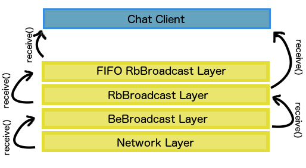

# Distributed Messaging
#### Ajay Panicker and James Watterson
## Design
Three broadcast algorithms were implemented in the creation of this chat application:
* Best Effort Broadcast
* Reliable Broadcast
* FIFO Reliable Broadcast

An important feature of these various broadcast algorithms is their dependency on one another.
That is to say Reliable Broadcast is implemented by making calls to Best Effort Broadcast and so on.
Such nature of these broadcast strategies simplified the design of the application because we were able to reuse a lot of the code.
Each broadcast implements atleast two intefaces, Broadcast and BroadcastReceiver.
The Broadcast interface ensures that methods are implemented for management of the broadcast (add and remove Processes), the initialization of the broadcast, and for the actual broadcasting itself.
The BroadcastReceiver interface is implemented to ensure that each broadcast implements the receive() method, which is called when the broadcast determines that a message may be delivered.
The important characteristic of combining these two interfaces is that it opens the broadcasts up to chainning.
Each broadcast requires a BroadcastReceiver for the init() method enforced by the Broadcast interface.
Therefore when a Broadcast determines that it may deliver a message, it calls receive() on its BroadcastReceiver, passing the message "up".
In the case of Reliable Broadcast, when Best Effort Broadcast delivers a message, it does so by calling receive() on its BroadcastReceiver which is an instance of RbBroadcast.

The chat application itself implements the BroadcastReceiver interface which makes the receive() method available to be called when a message needs to be printed on the screen.
Thus when the top-level broadcast strategy (either Reliable or FIFO Reliable Broadcast) determines a message should be displayed on screen, it calls receive() on its given BroadcastReceiver which is an instance of ChatClient.
The image below provides a summarization of the chainning aspect and overall design of the application.

## Benchmarks
#### 10 clients on 10 machines
Throughput using:
* ReliableBroadcast - X messages/second
* FIFOReliableBroadcast - Y messages/second

#### 10 clients on 5 machines
Throughput using:
* ReliableBroadcast - U messages/second
* FIFOReliableBroadcast - V messages/second
